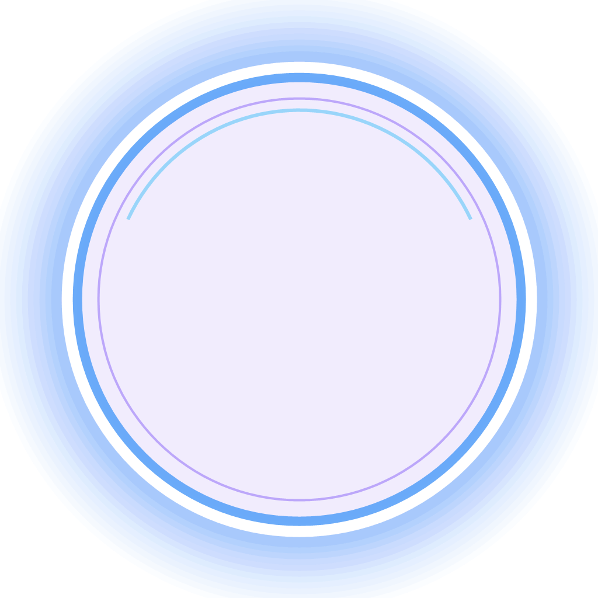

<h1 align="center">Hi 👋, I'm Aditya Sharma</h1>

<h3 align="center">
Full Stack Developer • MERN • Backend • Open Source
</h3>

Building scalable applications with modern technologies.

	
	
	
	

	

<table width="100%">
	<tr>
		<td width="58%" valign="top">
			<h2>About</h2>
			

				I build product-focused web applications with a dark, clean interface and a bias for performance.
				My day-to-day stack leans toward MERN, backend systems, and Linux-driven workflows, with a growing
				interest in infrastructure and automation.
			

			

				I care about shipping tools that feel polished, stay maintainable, and solve a real problem instead of
				just checking a technology box.
			

			<table>
				<tr>
					<td>🎓 B.Tech CSE</td>
					<td>🐧 Linux</td>
				</tr>
				<tr>
					<td>💻 MERN Stack</td>
					<td>🌱 Kubernetes + AWS</td>
				</tr>
				<tr>
					<td>🚀 Backend Systems</td>
					<td>✨ Open Source</td>
				</tr>
			</table>
		</td>
		<td width="42%" valign="top">
			<h2>Quick Profile</h2>
			
			
<i>Blue-glow frame for the profile photo or avatar treatment.</i>

		</td>
	</tr>
</table>

	

## Tech Stack

	

## Featured Projects

<table width="100%">
	<tr>
		<td width="50%" valign="top">
			<h3>Livique</h3>
			
Modern ecommerce platform with a refined shopping flow and responsive UI.

			
<strong>Stack:</strong> React, Node.js, MongoDB

		</td>
		<td width="50%" valign="top">
			<h3>NovaOS</h3>
			
Custom Linux-focused concept built around lightweight workflows and system control.

			
<strong>Stack:</strong> Linux, shell tooling, system automation

		</td>
	</tr>
	<tr>
		<td width="50%" valign="top">
			<h3>FahRide</h3>
			
Ride booking product designed for clear journeys, reliable tracking, and clean UX.

			
<strong>Stack:</strong> Full stack web app, maps, backend services

		</td>
		<td width="50%" valign="top">
			<h3>Offbyt</h3>
			
Developer tool and utility concept focused on fast workflows and practical automation.

			
<strong>Stack:</strong> CLI-first tooling, scripts, backend integrations

		</td>
	</tr>
</table>

## GitHub Analytics

	
	

	
	

## Achievements

	

	

## Connect

	
	
	
	

	

	

	

	<strong>Building products that matter.</strong>

